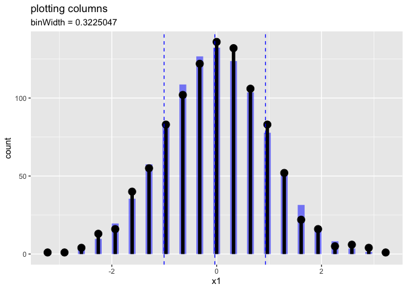
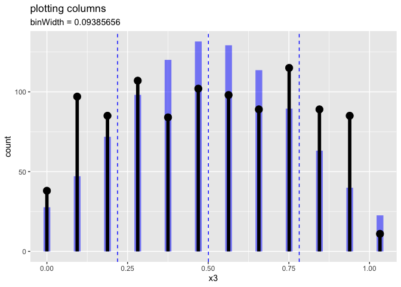

Making Many Plots
================

Recently we got a very polite question: how do you make many plots at
once using [`WVPlots`](https://github.com/WinVector/WVPlots)? The
specific ask was: how to apply `WVPlots::PlotDistCountNormal()` to every
numeric column in `data.frame`? Our opinion is: this is a great place to
learn the power of [`R`](https://www.r-project.org) ’s mapping and
iteration tools `vapply()` (returns a vector), `lapply()` (returns a
list), and `for(){}` (iterates over a vector or list). We have found
mastering these methods really ups your `R` game, and takes you much
further quicker than locking in early to packaged tools.

First lets attach our package and set up some example data.

``` r
library(WVPlots)
```

    ## Loading required package: wrapr

    ## Warning: replacing previous import 'vctrs::data_frame' by 'tibble::data_frame'
    ## when loading 'dplyr'

``` r
nrow <- 1000
d <- data.frame(
  x1 = rnorm(nrow),
  x2 = rnorm(nrow, mean = 3, sd = 2),
  x3 = runif(nrow),
  x4 = 'z',
  stringsAsFactors = FALSE)
```

([RTip set `stringsAsFactors =
FALSE`.](https://win-vector.com/2018/03/17/r-tip-use-stringsasfactors-false/))

A great way to make many plots at once is to use `R`’s list processing
capability `lapply()`. Our advice is to take the process slowly in
separate explainable steps.

First let’s land in a variable the list of columns we want. Moving
things from code to data is a good work pattern.

``` r
# all columns
columns_to_plot <- colnames(d)

# find which ones are numeric
is_numeric_column <- vapply(
  colnames(d),                                    # vector to work on
  function(col_name) is.numeric(d[[col_name]]),   # function to apply to each vector slot
  logical(1)                                      # expected return type of function, logical scalars                
  )

# select only the names of numeric columns
columns_to_plot <- columns_to_plot[is_numeric_column]

columns_to_plot
```

    ## [1] "x1" "x2" "x3"

If the above is confusing, run it step by step and `print()` the
intermediate results. The `vapply()` can seem imposing, but it is well
worth learning. `vapply()` takes three arguments: the vector to work
over, the function to apply to each item, and an example of the type we
expect the function to return. In this case we expect the `is.numeric()`
function to return a scalar logical `TRUE` or `FALSE`; I gave the
example type as `logical(1)`, but `TRUE` or `FALSE` would have worked as
well. I strongly encourage working in steps instead of deeply nested
code, so you can inspect intermediate results. `vapply()`’s specialty is
it returns a vector, which can be used as a set-oriented index with `[]`
to pick out the names we want.

Our advised style is: prefer sequences of operations on data to
composing nested code.

Also notice our ad-hoc anonymous function `function(col_name) {}` takes
a single argument which take each element of the vector we are working
on one at a time. The function can also refer to objects in our
workspace such as `d`, so we don’t need to try and pass them in as other
explicit function arguments.

Now we have the list of columns we want to plot. We then use `lapply()`
to apply our plotting function to each column. This is simpler that
`vapply()` as `lapply()` doesn’t have the third type-checking argument.
`lapply()` return a general list, which is great for holding complex
data such as plots, but harder to use as an array index.

``` r
# build our list of plots
plots <- lapply(
  columns_to_plot,      # items to work over
  function(col_name) {  # what to do to them
    binWidth = sd(d[[col_name]])/3  # pick a nice bin width
    PlotDistCountNormal(
      d,
      xvar = col_name,
      title = "plotting columns",
      binWidth = binWidth
    )
  }
)
```

Now we need to do something with the plots. We could print them all as
follows.

``` r
for(plt in plots) {
  print(plt)
}
```

<!-- --><!-- --><!-- -->

I like to add the names to the list of results.

``` r
names(plots) <- columns_to_plot
```

This makes task like saving all the plots easier to read.

``` r
for(col_name in names(plots)) {
  ggplot2::ggsave(
    paste0("plot_", col_name, ".png"),
    plots[[col_name]]
  )
}
```

    ## Saving 7 x 5 in image
    ## Saving 7 x 5 in image
    ## Saving 7 x 5 in image

This may seem long, but it uses a few core `R` tools that really pay off
in re-use value. Now there is always some frustration in practicing the
tools while in the middle of another task. However, we feel having some
appreciation for the `R` language when working with `R` pays off with
later speed and confidence.
