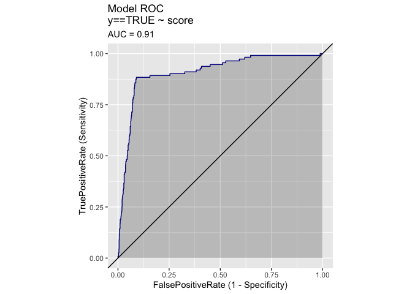
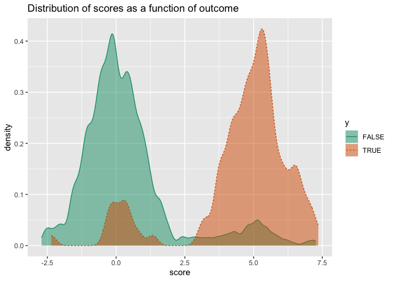
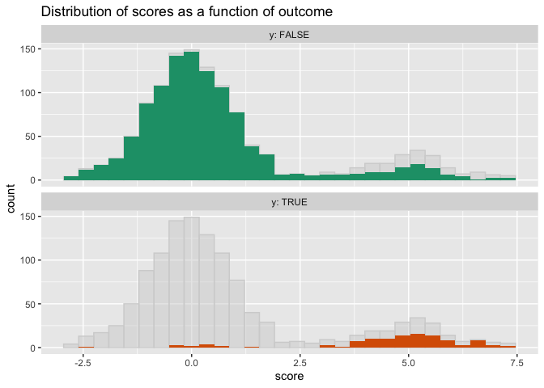
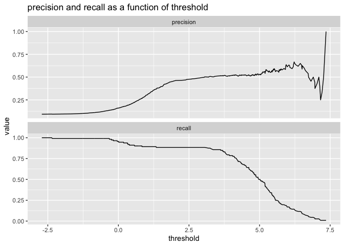
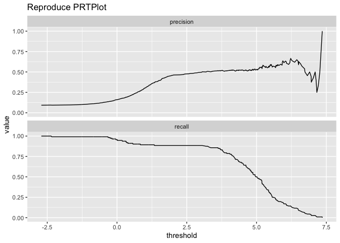
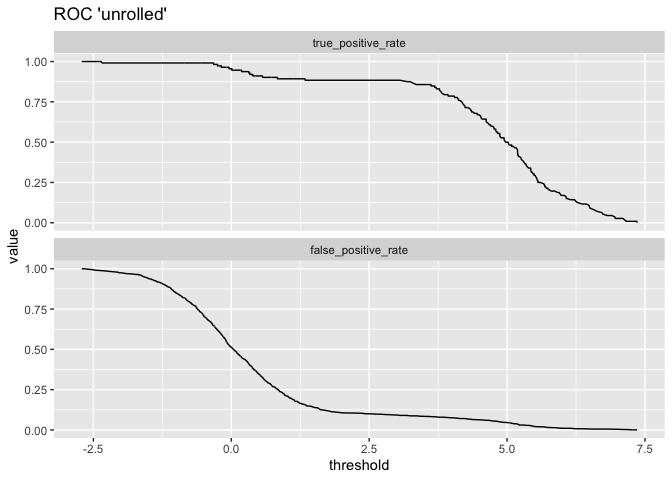
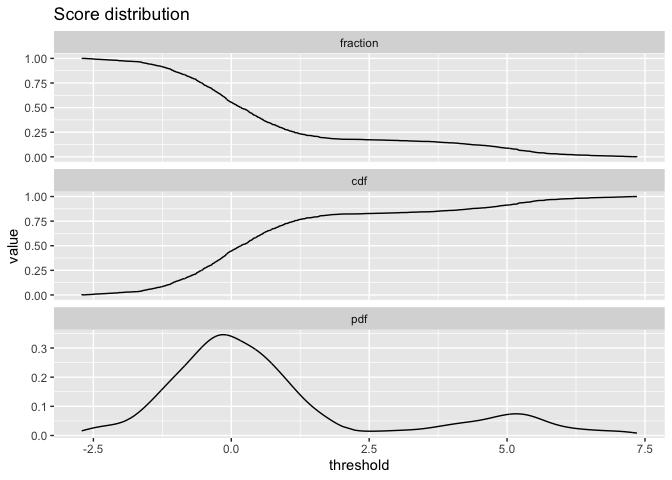
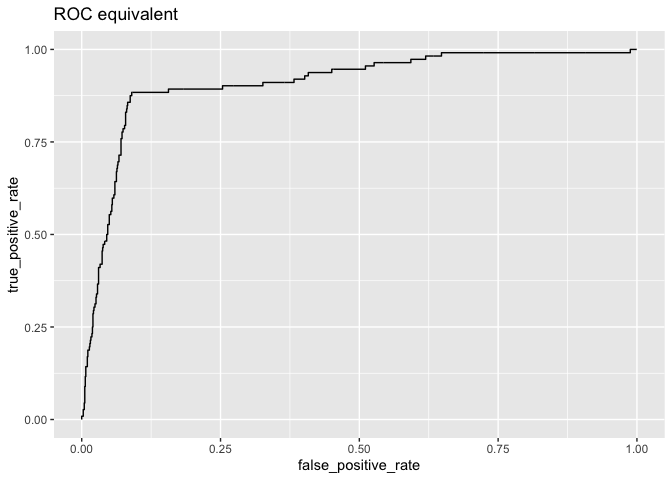
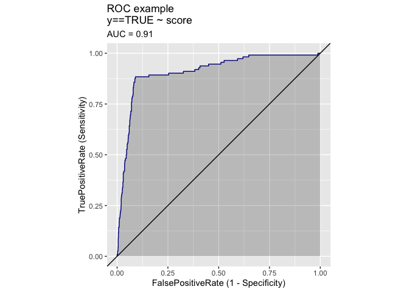

Threshold Selection for Classifiers
================
Nina Zumel

`WVPlots` has a variety of visualizations that help modelers to design
classifiers best suited to their goals. In particular, `ThresholdPlot`
is a tool to select classifier thresholds that give the best tradeoffs
among relevant performance metrics. This note demonstrates an example of
using `WVPlots` to evaluate and design classifiers.

## Example Data

Here we create an example synthetic data set, where `score` is the score
produced by a trained model, and `y` is the actual outcome in the
evaluation data set (`TRUE` or `FALSE`).

``` r
library(WVPlots)
```

    ## Loading required package: wrapr

``` r
set.seed(1452225)

# data with two different regimes of behavior
d <- rbind(
  data.frame(
    score = rnorm(1000),
    y = sample(c(TRUE, FALSE), prob = c(0.02, 0.98), size = 1000, replace = TRUE)),
  data.frame(
    score = rnorm(200) + 5,
    y = sample(c(TRUE, FALSE), size = 200, replace = TRUE))
)
```

One can create different classifiers from this single model, with
different performance metrics, by varying the decision threshold. Datums
that score higher than the threshold are predicted to be in the class of
interest (`TRUE`).

The ROC plot gives this model an AUC of 0.91, which seems pretty high.

``` r
ROCPlot(d, "score", "y", truthTarget=TRUE, title="Model ROC")
```

<!-- -->

The double density plot shows that in general, true instances score
higher than most false instances. It further suggests that a threshold
in the “valley” of the plot, say around a value of 2.5, would achieve
good separation between true and false instances. But is that separation
good enough to achieve project goals?

``` r
DoubleDensityPlot(d, "score", "y", title="Distribution of scores as a function of outcome")
```

<!-- -->

A big disadvantage of both the ROC and double density plots is that they
hide the fact that the classes are unbalanced; this is more obvious when
the TRUE and FALSE distributions are separated. We can show the actual
class prevalences with `ShadowHist`:

``` r
ShadowHist(d, "score", "y", title="Distribution of scores as a function of outcome")
```

<!-- -->

Notice that from the `ShadowHist` we can see that datums that score
above a threshold of 2.5 may *not* be majority true instances. So while
this model may look pretty good initially, we still aren’t sure if we
can pick a threshold that produces a classification rule that meets
project goals.

## `PRTPlot`: Plotting Precision vs Recall

For a given model, `PRTPlot` plots the precision and recall for
different choices of threshold. As is expected, higher thresholds give
higher precision, at the cost of lower recall.

``` r
PRTPlot(d, "score", "y",  truthTarget=TRUE, title="precision and recall as a function of threshold")
```

<!-- -->

The plot suggests that a threshold of 2.5 produces a classifier with
about 87% recall, but only 50% precision. Depending on the project
goals, this may or may not be good enough. Unfortunately this model
can’t achieve higher precision without drastically impairing recall,
so if higher simultaneous precision and recall are needed, it may be
time to go back to the drawing board.

## `ThresholdPlot`: Plotting Other Metrics by Threshold

If precision/recall aren’t the performance metrics for your application,
`ThresholdPlot` produces similar plots for a variety of classifier
metrics. See the
[documentation](https://winvector.github.io/WVPlots/reference/ThresholdPlot.html)
for all the metrics that can be plotted; here are a few examples.

``` r
# replicate PRTPlot. Looks a little different because ThresholdPlot does different smoothing
ThresholdPlot(d, "score", "y", title="Reproduce PRTPlot",
              truth_target=TRUE, # default
              metrics = c("precision", "recall"))
```

<!-- -->

``` r
# default: sensitivity/specificity
ThresholdPlot(d, "score", "y", title="Sensitivity and Specificity as a Function of Threshold")
```

<!-- -->

### “Unrolling” the ROC

One useful application of `ThresholdPlot` is to “unroll” an ROC plot: if
the ROC shows that your model can meet an acceptable trade-off of true
positive rate and false positive rate, then `ThresholdPlot` can tell you
which threshold achieves that goal.

``` r
ThresholdPlot(d, "score", "y", title="ROC 'unrolled'",
              metrics = c("true_positive_rate", "false_positive_rate"))
```

<!-- -->

Our example model with a threshold of 2.5 achieves a true positive rate
(or recall) of about 87%, with a false positive rate of about 12%.

## Diagnostics on Data Distribution

`ThresholdPlot` can also be used to show some possibly useful
diagnostics on score distribution. `fraction` and `count` measure how
much of the data scores above a given threshold value. `cdf` is 1 -
`fraction`, or the CDF of the scores (how much of the data is below a
given threshold value). `pdf` is the PDF of the scores.

``` r
ThresholdPlot(d, "score", "y", title="Score distribution",
              metrics = c("fraction", "cdf", "pdf"))
```

<!-- -->

## `MetricPairPlot`

`MetricPairPlot` provides another way of visualizing the tradeoffs
between a pair of complementary performance metrics, by plotting them
against each other. For instance, plotting true\_positive\_rate vs
false\_positive\_rate gives you the equivalent of the ROC.

``` r
MetricPairPlot(d, 'score', 'y', title='ROC equivalent',
                 x_metric = "false_positive_rate", # default
                 y_metric = "true_positive_rate")  # default
```

<!-- -->

The above plot is just an ad-hoc version of `ROCPlot`.

``` r
# Plot ROCPlot for comparison
ROCPlot(d, 'score', 'y', truthTarget=TRUE, title='ROC example')
```

<!-- -->

You can plot other pairs as well, for instance precision vs. recall:

``` r
MetricPairPlot(d, 'score', 'y', title='recall/precision', x_metric = 'recall', y_metric = 'precision')
```

<!-- -->

`MetricPairPlot` takes the same metrics as `ThresholdPlot`. See the
[documentation](https://winvector.github.io/WVPlots/reference/MetricPairPlot.html)
for details.
